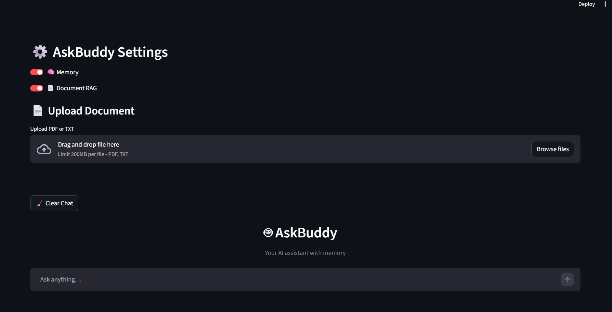

🤖 AskBuddy – AI Assistant with Memory & RAG

AskBuddy is a production-ready conversational AI built using **LangChain, Streamlit, PostgreSQL, and ChromaDB**.  
It supports **persistent memory**, **document-based question answering (RAG)**, and **real-time streaming responses**, similar to ChatGPT.

## 🚀 Features

### 🧠 Persistent Memory (ChatGPT-style)
- Stores full chat history in **PostgreSQL**
- Uses **sliding-window memory** for recent context
- Automatically generates and stores **conversation summaries**
- Restores memory seamlessly on page refresh

### 📄 Retrieval-Augmented Generation (RAG)
- Upload **PDF or TXT documents**
- Documents are chunked and embedded
- Relevant context is injected into the prompt
- Displays **sources used** for transparency

### ⚡ Real-time AI Streaming
- Token-by-token streaming responses
- Smooth chat experience using Streamlit

### 🎨 Modular UI Architecture
- Clean separation of:
  - `ui/` → UI components
  - `rag/` → Document retrieval logic
  - `db/` → PostgreSQL persistence
- Easy to extend and maintain

## 🏗️ Project Structure

AskBuddy is a production-ready conversational AI built using **LangChain, Streamlit, PostgreSQL, and ChromaDB**.  
It supports **persistent memory**, **document-based question answering (RAG)**, and **real-time streaming responses**, similar to ChatGPT.

## 🚀 Features

### 🧠 Persistent Memory (ChatGPT-style)
- Stores full chat history in **PostgreSQL**
- Uses **sliding-window memory** for recent context
- Automatically generates and stores **conversation summaries**
- Restores memory seamlessly on page refresh

### 📄 Retrieval-Augmented Generation (RAG)
- Upload **PDF or TXT documents**
- Documents are chunked and embedded
- Relevant context is injected into the prompt
- Displays **sources used** for transparency

### ⚡ Real-time AI Streaming
- Token-by-token streaming responses
- Smooth chat experience using Streamlit

### 🎨 Modular UI Architecture
- Clean separation of:
  - `ui/` → UI components
  - `rag/` → Document retrieval logic
  - `db/` → PostgreSQL persistence
- Easy to extend and maintain

## 🏗️ Project Structure

AskBuddy/
│
├── app.py # Main Streamlit application
│
├── ui/
│ ├── header.py # App header UI
│ ├── sidebar.py # Sidebar controls (Memory, RAG, Upload)
│ ├── chat.py # Chat rendering & streaming
│ └── styles.css # Custom UI styling
│
├── rag/
│ ├── loader.py # PDF / TXT loaders
│ ├── retriever.py # Context retrieval + sources
│ ├── vectorstore.py # ChromaDB setup
│ └── embeddings.py # Embedding model
│
├── db/
│ ├── database.py # SQLAlchemy engine
│ ├── models.py # DB models
│ ├── crud.py # DB operations
│ └── init_db.py # Table initialization
│
├── .env # Environment variables
├── requirements.txt
└── README.md

## 🛠️ Tech Stack

- **Frontend**: Streamlit
- **LLM Orchestration**: LangChain
- **Model**: qwen3 (OpenAI-compatible API)
- **Vector DB**: ChromaDB
- **Database**: PostgreSQL
- **ORM**: SQLAlchemy
- **Embeddings**: OpenAI-compatible embeddings
